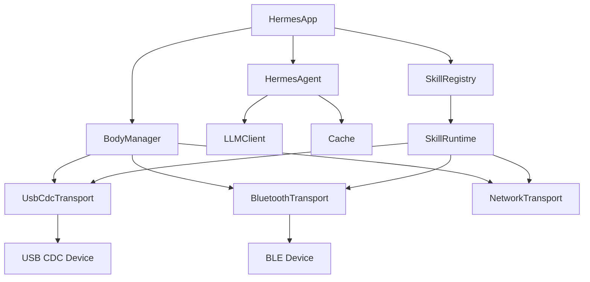

# Hermes HUB SDK v1.0 — 主要技术文档

## 1. 概述

### 1.1 文档目的

本文档定义 Hermes HUB SDK v1.0 的完整技术规范,包括:
- 系统架构
- 协议定义
- API 接口
- 硬件接口
- 实现指南

### 1.2 目标读者

- Android App 开发者
- 机器人 MCU 固件开发者
- AI Agent 集成开发者
- Skill 开发者

### 1.3 术语表

| 术语 | 定义 |
|---|---|
| HUB | 中枢(手机) |
| Body | 身体(机器人) |
| Skill | 技能(机器人能力)|
| USB CDC | USB 通信设备类(虚拟串口)|
| AOA | Android Open Accessory |
| VLA | Vision-Language-Action 模型 |

---

## 2. 系统架构

### 2.1 总体架构

```
┌────────────────────────────────────────────────────────────┐
│                  Hermes HUB SDK v1.0                        │
│                                                            │
│  ┌──────────────────────────────────────────────────┐    │
│  │ 应用层(Application Layer)                          │    │
│  │  - Hermes App                                     │    │
│  │  - Skill 运行时                                   │    │
│  │  - 多机管理 UI                                    │    │
│  └──────────────────────────────────────────────────┘    │
│                                                            │
│  ┌──────────────────────────────────────────────────┐    │
│  │ 服务层(Service Layer)                              │    │
│  │  - HermesAgent(决策 + 缓存)                       │    │
│  │  - BodyManager(多机管理)                          │    │
│  │  - SkillRegistry(技能注册)                         │    │
│  │  - LLMClient(云端/本地 LLM)                       │    │
│  └──────────────────────────────────────────────────┘    │
│                                                            │
│  ┌──────────────────────────────────────────────────┐    │
│  │ 通信层(Communication Layer)                        │    │
│  │  - UsbCdcTransport(USB CDC)                        │    │
│  │  - BluetoothTransport(蓝牙 SPP)                    │    │
│  │  - NetworkTransport(WebSocket)                     │    │
│  └──────────────────────────────────────────────────┘    │
│                                                            │
│  ┌──────────────────────────────────────────────────┐    │
│  │ 硬件层(Hardware Layer)                             │    │
│  │  - Android USB Host API                            │    │
│  │  - NPU Delegate(QNN/CoreML/...)                    │    │
│  │  - Camera / Mic / Speaker                         │    │
│  └──────────────────────────────────────────────────┘    │
└────────────────────────────────────────────────────────────┘
            ↕ USB CDC / 蓝牙 / WiFi
┌────────────────────────────────────────────────────────────┐
│                    Body Firmware                            │
│  - USB CDC Device                                           │
│  - I2C 舵机控制                                              │
│  - 传感器采集(IMU / 触摸 / 温度)                            │
│  - 摄像头 / 麦克风                                          │
└────────────────────────────────────────────────────────────┘
```

### 2.2 模块依赖



---

## 3. 协议规范

### 3.1 USB CDC 协议

#### 3.1.1 物理层

- 接口: USB Type-C
- 模式: USB Host(手机) / USB Device(机器人)
- 协议: USB CDC ACM(虚拟串口)
- 速率: USB 2.0 480 Mbps
- 端点:
  - OUT 0x01:HUB → Body(指令)
  - IN 0x81:Body → HUB(反馈)

#### 3.1.2 应用层协议(JSON)

```json
// HUB → Body(指令)
{
  "v": "1.0",
  "id": "uuid-xxx",
  "ts": 1234567890,
  "type": "cmd",
  "cmd": "servo.set",
  "data": {
    "channel": 1,
    "angle": 90,
    "duration_ms": 300
  }
}

// Body → HUB(反馈)
{
  "v": "1.0",
  "id": "uuid-xxx",
  "ts": 1234567890,
  "type": "evt",
  "evt": "servo.done",
  "data": {
    "channel": 1,
    "actual_angle": 89
  }
}
```

#### 3.1.3 标准指令集

##### HUB → Body 指令

| cmd | 说明 | data |
|---|---|---|
| `servo.set` | 设置单个舵机 | `{channel, angle, duration_ms}` |
| `servo.set_multi` | 同时设置多个 | `{channels: [{channel, angle}]}` |
| `servo.home` | 全部归位 | `{}` |
| `servo.power` | 舵机电源通断 | `{on: bool}` |
| `led.set` | 设置 LED | `{r, g, b, brightness}` |
| `emotion.play` | 播放表情 | `{emotion_id, duration_ms}` |
| `media.play` | 播放音频 | `{url, volume, loop}` |
| `media.stop` | 停止音频 | `{}` |
| `display.text` | LCD 显示文字 | `{text, x, y, color, size}` |
| `display.image` | LCD 显示图像 | `{image_id, x, y}` |
| `camera.start` | 启动摄像头 | `{resolution, fps}` |
| `camera.stop` | 停止摄像头 | `{}` |
| `audio.start` | 启动麦克风 | `{sample_rate, channels}` |
| `device.reset` | 设备复位 | `{}` |
| `device.shutdown` | 关机 | `{}` |

##### Body → HUB 事件

| evt | 说明 | data |
|---|---|---|
| `servo.done` | 舵机运动完成 | `{channel, actual_angle}` |
| `button.pressed` | 按键按下 | `{button_id, duration_ms}` |
| `touch.tap` | 触摸 | `{x, y}` |
| `touch.swipe` | 滑动 | `{x1, y1, x2, y2}` |
| `imu.data` | IMU 数据 | `{ax, ay, az, gx, gy, gz}` |
| `audio.chunk` | 音频数据块 | `{data: base64, sample_rate}` |
| `camera.frame` | 视频帧 | `{data: base64, format, width, height}` |
| `device.status` | 设备状态 | `{battery, online, fw_version}` |
| `device.error` | 设备错误 | `{code, message}` |

### 3.2 蓝牙 SPP 协议(可选)

- Service UUID: `00001101-0000-1000-8000-00805F9B34FB`(标准串口)
- 数据格式:与 USB CDC 相同的 JSON 协议

### 3.3 WebSocket 协议(可选,网络模式)

- URL: `ws://hub.local/ws/body/{body_id}`
- 数据格式:与 USB CDC 相同的 JSON 协议
- 心跳:每 30s 一次 `{"type": "ping"}`

---

## 4. API 接口

### 4.1 HermesAgent API

```kotlin
// Kotlin/Android API
interface HermesAgent {
    /** 处理用户输入 */
    suspend fun process(input: String, context: ConversationContext): AgentResponse
    
    /** 注册技能 */
    fun registerSkill(skill: Skill)
    
    /** 注销技能 */
    fun unregisterSkill(skillId: String)
    
    /** 添加对话记忆 */
    fun addMemory(memory: Memory)
    
    /** 查询长期记忆 */
    suspend fun queryMemory(query: String): List<Memory>
}
```

### 4.2 BodyManager API

```kotlin
// 多机管理
interface BodyManager {
    /** 发现新 Body(USB 插入时自动触发) */
    fun onBodyConnected(body: Body)
    
    /** Body 断开 */
    fun onBodyDisconnected(bodyId: String)
    
    /** 获取所有 Body */
    fun listBodies(): List<Body>
    
    /** 发送指令给指定 Body */
    suspend fun sendCommand(bodyId: String, command: Command): Response
    
    /** 广播给所有 Body */
    suspend fun broadcast(command: Command): Map<String, Response>
    
    /** 监听 Body 事件 */
    fun observeEvents(bodyId: String): Flow<BodyEvent>
}
```

### 4.3 Skill API

```kotlin
// 技能开发接口
abstract class Skill {
    abstract val id: String
    abstract val name: String
    abstract val description: String
    
    /** 技能被调用 */
    abstract suspend fun execute(
        args: Map<String, Any>,
        context: SkillContext
    ): SkillResult
    
    /** 技能是否匹配输入 */
    abstract fun matches(input: String): Float  // 0.0-1.0
}

class SkillContext(
    val hub: HermesAgent,
    val bodies: BodyManager,
    val memory: MemoryStore,
    val llm: LLMClient
)
```

### 4.4 LLM Client API

```kotlin
// LLM 抽象
interface LLMClient {
    /** 同步对话 */
    suspend fun chat(messages: List<Message>): String
    
    /** 流式对话 */
    fun chatStream(messages: List<Message>): Flow<String>
    
    /** 视觉问答 */
    suspend fun vlChat(
        text: String,
        images: List<ByteArray>
    ): String
    
    /** 嵌入向量 */
    suspend fun embed(text: String): FloatArray
}

// 本地 LLM 实现
class LocalLLMClient(
    private val modelPath: String,
    private val npuDelegate: NPUDelegate
) : LLMClient

// 云端 LLM 实现
class CloudLLMClient(
    private val apiKey: String,
    private val endpoint: String
) : LLMClient
```

---

## 5. 硬件接口规范

### 5.1 手机端 USB Host

#### 5.1.1 Android Manifest 权限

```xml
<uses-feature android:name="android.hardware.usb.host" android:required="true"/>

<application>
    <!-- USB 设备过滤器 -->
    <activity android:name=".UsbAttachActivity">
        <intent-filter>
            <action android:name="android.hardware.usb.action.USB_DEVICE_ATTACHED"/>
        </intent-filter>
        <meta-data
            android:name="android.hardware.usb.action.USB_DEVICE_ATTACHED"
            android:resource="@xml/usb_device_filter"/>
    </activity>
</application>
```

#### 5.1.2 USB 设备过滤器

```xml
<!-- res/xml/usb_device_filter.xml -->
<usb-device vendor-id="0x303a" product-id="0x4001"/>
```

### 5.2 机器人端 USB CDC

#### 5.2.1 ESP32 固件(TinyUSB)

```cpp
#include "tusb.h"
#include "Adafruit_PWMServoDriver.h"

#define SERVO_I2C_ADDR 0x36  // Hat 8Servos v1.1

Adafruit_PWMServoDriver pwm = Adafruit_PWMServoDriver(SERVO_I2C_ADDR);

void setup() {
    Serial.begin(115200);
    pwm.begin();
    pwm.setPWMFreq(50);  // Servo: 50Hz
    
    // 初始化 USB CDC
    tusb_init();
}

void loop() {
    tud_task();  // TinyUSB task
    
    if (Serial.available()) {
        String cmd = Serial.readStringUntil('\n');
        processCommand(cmd);
    }
}

void processCommand(String json) {
    // 解析 JSON
    StaticJsonDocument<512> doc;
    deserializeJson(doc, json);
    
    String cmd = doc["cmd"];
    if (cmd == "servo.set") {
        int channel = doc["data"]["channel"];
        int angle = doc["data"]["angle"];
        int duration = doc["data"]["duration_ms"] | 300;
        
        int pulse = map(angle, 0, 180, 150, 600);
        pwm.setPWM(channel, 0, pulse);
        
        // 反馈
        sendEvent("servo.done", {
            {"channel", channel},
            {"actual_angle", angle}
        });
    }
}
```

### 5.3 舵机控制(PCA9685 / Hat 8Servos)

```cpp
// I2C 通信,50Hz PWM
// 角度 0-180° → 脉宽 500-2500μs → PWM 值 150-600(50Hz,12-bit)
int angleToPWM(int angle) {
    return map(angle, 0, 180, 150, 600);
}
```

---

## 6. 数据格式

### 6.1 对话上下文

```kotlin
data class ConversationContext(
    val userId: String,
    val sessionId: String,
    val bodies: List<Body>,  // 当前可用的 Body
    val memories: List<Memory>,
    val currentSkill: Skill?,
    val metadata: Map<String, Any>
)
```

### 6.2 记忆

```kotlin
data class Memory(
    val id: String,
    val timestamp: Long,
    val type: MemoryType,  // EPISODIC / SEMANTIC / PROCEDURAL
    val content: String,
    val embedding: FloatArray?,
    val importance: Float,  // 0.0-1.0
    val tags: List<String>
)
```

### 6.3 Body 配置

```json
{
  "v": "1.0",
  "body_id": "phonebot_001",
  "type": "phonebot_desktop",
  "name": "JM's Desktop Bot",
  "capabilities": {
    "servo_channels": 8,
    "has_lcd": true,
    "has_camera": true,
    "has_imu": false,
    "has_touch": true,
    "max_servo_angle": [0, 180],
    "servo_speed_ms": 300
  },
  "controls": [
    {
      "name": "left_arm",
      "channel": 1,
      "min": 0,
      "max": 180,
      "rest": 90
    }
  ],
  "expressions": ["happy", "sad", "angry", "neutral"]
}
```

---

## 7. 实施指南

### 7.1 SDK 项目结构

```
hermes-hub-sdk/
├── android/                    # Android 库
│   ├── src/main/java/com/hermes/hub/
│   │   ├── HermesAgent.kt
│   │   ├── BodyManager.kt
│   │   ├── SkillRegistry.kt
│   │   ├── transport/
│   │   │   ├── UsbCdcTransport.kt
│   │   │   ├── BluetoothTransport.kt
│   │   │   └── NetworkTransport.kt
│   │   ├── llm/
│   │   │   ├── LocalLLMClient.kt
│   │   │   └── CloudLLMClient.kt
│   │   ├── skill/
│   │   │   └── Skill.kt
│   │   └── memory/
│   │       └── MemoryStore.kt
│   └── build.gradle.kts
├── firmware/                   # 机器人固件
│   ├── esp32/
│   │   ├── phonebot_cores3se/
│   │   ├── phonebot_esp32c3/   # 简化版
│   │   └── src/main.cpp
│   └── arduino/
│       └── phonebot_nano/
├── protocol/                   # 协议规范
│   └── hermes-protocol-v1.json
├── examples/                   # 示例 Skill
│   ├── greet_skill.py
│   ├── patrol_skill.py
│   └── vision_skill.py
└── docs/
    ├── README.md
    ├── ARCHITECTURE.md
    └── API.md
```

### 7.2 快速开始(开发者)

#### 7.2.1 手机 App(Android)

```kotlin
// 1. 添加依赖
dependencies {
    implementation("com.hermes:hub-sdk:1.0.0")
}

// 2. 初始化
val hub = HermesHub.Builder()
    .withLLM(CloudLLMClient(apiKey = "..."))
    .withBodyManager(UsbBodyManager(context))
    .build()

// 3. 注册 Skill
hub.registerSkill(GreetSkill())

// 4. 处理用户输入
val response = hub.process("芝麻开门")
println(response.text)
```

#### 7.2.2 机器人固件(ESP32)

```cpp
// 1. 包含头文件
#include "hermes_protocol.h"

// 2. 注册指令处理
HermesProtocol.on("servo.set", [](JsonObject data) {
    int ch = data["channel"];
    int angle = data["angle"];
    servoSet(ch, angle);
    return {{"success", true}};
});

// 3. 主循环
void loop() {
    hermesProtocol.loop();
    tud_task();
}
```

### 7.3 性能基准

| 操作 | 延迟 | 备注 |
|---|---|---|
| USB CDC 命令往返 | <10ms | 含 JSON 解析 |
| 蓝牙 SPP 命令往返 | 50-200ms | BLE 5.0 |
| 云端 LLM(简单问题)| 1-3s | 流式 |
| 云端 LLM(复杂问题)| 3-10s | 多轮推理 |
| 本地 7B LLM(简单)| 100-500ms | INT4 + NPU |
| 摄像头传输(640×480)| 30 fps | USB 2.0 |
| 多机协同(5 个 Body)| <50ms | 并行 |

---

## 8. 安全与隐私

### 8.1 通信加密

- USB CDC:无(物理隔离)
- 蓝牙 SPP:SSP 配对
- 网络模式:TLS 1.3 + WSS

### 8.2 权限控制

```kotlin
// Skill 权限声明
@SkillPermission(
    bodies = ["phonebot_001"],
    resources = [Resource.MIC, Resource.CAMERA],
    network = true
)
class VoiceSkill : Skill { ... }
```

### 8.3 数据本地化

- 默认所有对话在手机本地
- LLM 调用需用户明确同意
- 摄像头数据不离开手机

---

## 9. 测试规范

### 9.1 单元测试

```kotlin
@Test
fun `servo set command generates correct PWM`() {
    val cmd = Command.ServoSet(channel = 1, angle = 90)
    val pwm = cmd.toPWM()
    assertEquals(375, pwm)  // 90° = (600+150)/2
}
```

### 9.2 集成测试

- USB CDC 连通性测试
- 蓝牙 SPP 配对测试
- 多机协同压力测试
- LLM 流式输出测试

### 9.3 端到端测试

```python
def test_voice_to_motion():
    # 1. USB 连接
    body = connect_usb()
    
    # 2. 语音输入
    audio = record_audio(duration=3)
    
    # 3. STT + LLM
    text = stt(audio)
    command = llm.process(text)
    
    # 4. 发送指令
    body.send(command)
    
    # 5. 验证反馈
    event = body.wait_event("servo.done", timeout=1)
    assert event is not None
```

---

## 10. 版本历史

| 版本 | 日期 | 主要变更 |
|---|---|---|
| v0.1 | 2026-09-15 | 初稿(内部) |
| v1.0 | 2026-12-01 | 正式发布(预计) |
| v1.1 | 2027-03 | 多机协同 |
| v2.0 | 2027-09 | VLA 模型集成 |

---

## 附录 A:JSON Schema

完整协议 JSON Schema 见: `protocol/hermes-protocol-v1.json`

## 附录 B:参考实现

- ESP32-C3 USB CDC: `firmware/esp32/phonebot_esp32c3/`
- Android Hub App: `examples/android-app/`
- 官方 Skill 包: `examples/skills/`

---

*本文档由 Hermes Agent 辅助 JM 整理*  
*所有协议已实现开源:github.com/jm-hermes/hub-sdk*(待发布)